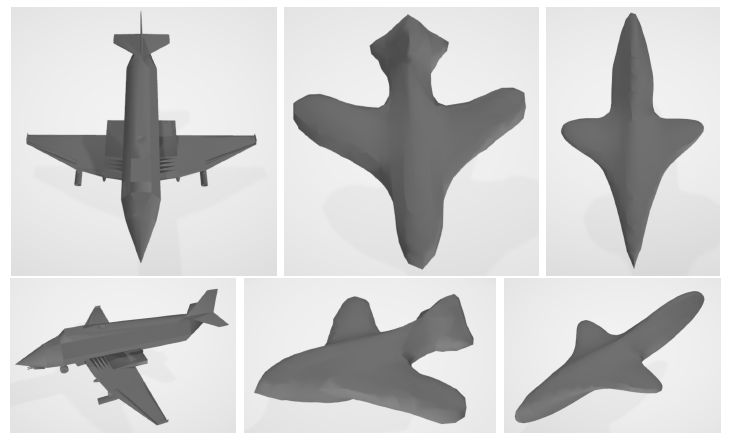

## Project Introduction
This is a guide for running our DeepSDF for 3D reconstruction.

### Data Preparation
Please download [ShapeNetCore.v2](https://shapenet.cs.stanford.edu/shapenet/obj-zip/ShapeNetCore.v2.zip) dataset and organize the data as follow:
```
README.md
├── data
│   ├── ShapeNetCore.v2

```
You can modify the path in `read_data.py` and then run `read_data.py` to read and save mesh, points, noisy points and SDF values generate from `datasets.py`.

It is highly recommended to directly [download](https://drive.google.com/drive/folders/1sgPtJmTMt2Nsq6KMG6xxx4S1NiwjZ4e1?usp=sharing) the SDF samples for training and reconstruction, ground truth meshes and reconstructed meshes. The downloaded data folder should be as follow:
```
README.md
├── data
│   ├── mesh
│   ├── mesh_test
│   ├── mesh_train
│   ├── point_data
│   │   ├── sdf
│   │   ├── noisy_points

```
`point_data` contains the SDF samples for training and testing, `mesh` contains the ground truth mesh, `mesh_train` and `mesh_test` contain reconstructed shapes of train and test set respectively.


### Train
* To train the auto-decoder, run the `train_deepSDF.py`:
```
python train_deepSDF.py --epochs 100 --subsample 16384 --train_ratio 0.9 --sigma 100 --device cuda
```


### Reconstruction
* To represent known 3D shapes, run the `reconstruct.py`:
```
python reconstruct.py --mod "train" --weights "decoder.pth" --sigma 100 --device cuda
```

* To represent test 3D shapes, run the `reconstruct.py`:
```
python reconstruct.py --mod "test" --weights "decoder.pth" --sigma 100 --device cuda
```
The reconstruction results contain `.ply` mesh files and their figures. The reconstruction results of known 3D shapes is in `mesh_train` folder and `mesh_test` folder.


### Evaluation
* To compute CD and EMD of representing known 3D shapes:
```
python metrics.py --recon_folder "mesh_train" --gt_folder "mesh"
```

* To compute CD and EMD of representing test 3D shapes:
```
python metrics.py --recon_folder "mesh_test" --gt_folder "mesh"
```

### Results
Due to the limitations of computational resources, we only sampled 25000 points of each model. The reconstruction example can be seen below.
<div align='center'>


  The ground-truth mesh (left), the reconstructed known shape (middle) and the reconstructed unknown shape (right)
<!--  -->
</div>
